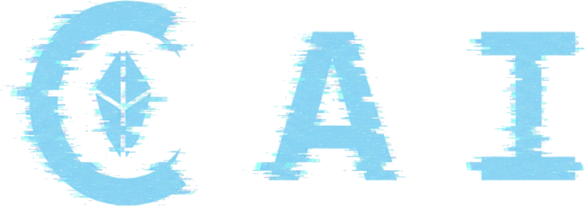

<!--
SPDX-FileCopyrightText: 2026 CAI contributors
SPDX-License-Identifier: MIT
-->
<p align="center">
  
</p>

CAI is an open decentralized network for LLM compute. It connects users, executors, validators, and developers into one system where model requests can run locally or through participant machines, while completed work is tracked and paid in the `CAICN` token.

🧪 Current status: **mainnet alpha**. The core network cycle is already implemented: `CAICN` coins, wallet flows, transfers, settlement, and reward accounting work in the current network. The public network is still in an early experimental mode and is suitable for development, test deployments, early nodes, and gradual verification of real decentralized compute.

## 🌐 CAI

CAI is built around a simple idea: AI compute does not have to live only inside centralized clouds. Network participants can provide resources, receive jobs, execute model work, and earn rewards. Users get an interface for model requests, while the network selects an available execution path.

CAI is useful for:

- users who need access to LLM models through a local interface and an executor network;
- users and teams that need a compute layer for their own AI agents;
- executors who want to connect CPU/GPU resources and earn for real work;
- validators who confirm calculations, settlement, and network state.

## ✅ What is implemented

- Windows portable/desktop application with a web interface.
- CAI wallet: creation, recovery, locking, unlocking, balances, and transfers.
- Main network `mainnet` and isolated test network `testnet`.
- User, executor, validator, and relay/bootstrap roles.
- Model requests through the local API and web UI.
- Interface and API path for using CAI as a backend for custom AI agents.
- GGUF/llama.cpp model support in the runtime layer.
- Settlement layer for recording completed AI jobs and assigning rewards.
- Reward distribution between executors and the validator settlement pool.
- Genesis economy with `1,000,000,000 CAICN`, founder treasury, and developer contribution fund.
- Blockchain layer with indexes, snapshots, address history, and settlement records.
- Hybrid post-quantum direction for wallets and signatures: Ed25519 + ML-DSA-65.
- Documented developer fund, voting, and payout round confirmation rules.

## 🛠️ What is being hardened

- Distributed inference between two or more physical PCs is under live verification.
- The PC-to-PC data plane contains direct routes and relay/reverse-relay paths; live test stands verify that the validator does not become a data bottleneck.
- Executor disconnects are handled through job redistribution, retry routes, clear timeouts, and honest explainable errors.
- A growing blockchain is served by indexes and snapshots; pruning, archiving, snapshot recovery, and load checks are part of alpha stabilization.
- Consensus and finality for multi-validator scenarios are under a dedicated verification track.
- Public audit, load tests, and security review are part of preparation for a mature production network.

## ⚙️ How it works

1. A user opens CAI, creates or unlocks a wallet, and sends a model request.
2. The request comes from the web UI, local API, or an external AI agent that uses CAI as a compute backend.
3. The runtime checks local resources and available network executors.
4. The network selects a suitable execution path: local, one executor, or several participants when a task benefits from distribution.
5. The executor loads the required model or required model part, performs its work, and returns the result.
6. CAI creates a receipt for the completed work.
7. A validator confirms settlement and records the resulting accounting changes.
8. The reward is distributed between executors and the validator settlement pool.

CAI follows one key architectural rule: the validator is not a permanent proxy for working data. Validators confirm state and accounting, while working data moves directly between nodes or through relay paths only where relay is needed for connectivity.

## 💰 Economy

Network currency: `CAICN` (`CAI Network Credit`).

Base model:

- total supply: `1,000,000,000 CAICN`;
- `85%` - compute reserve that supports useful network work;
- `5%` - founder treasury;
- `10%` - developer contribution fund;
- `98%` of an AI job price goes to executors;
- `2%` goes to the validator settlement pool.

## ✨ Features

- Useful-work focus: rewards are tied to AI compute, not empty activity.
- Decentralized inference: executors connect real machines and participate in request processing.
- Compute backend for AI agents: custom agents can use CAI as an interface to local or network models.
- AI runtime, wallet, settlement, and web UI are packaged in one portable application.
- Local inference and distributed loading of model parts are both supported by the project architecture.
- Open developer fund model that accounts for and rewards developer contributions.
- Hybrid post-quantum security direction before mature public-network operation.

## 🔌 Integrations

- `llama.cpp` / GGUF for local model execution.
- OpenAI-style chat/completions path in the runtime API layer.
- Web dashboard for requests, network state, wallet state, and updates.
- Local interface/API for external AI agents and applications.
- Python CLI for wallet, validator, settlement, CAI startup, and checks.
- Portable update, local launch tooling, and release artifact checks.

## 📋 Requirements

To clone and run CAI from source, install:

- Git.
- Python `3.13` or newer.
- Rust toolchain with `cargo` for the native Python binding.
- Node.js `22` or newer with `npm` for the web dashboard.
- Windows: PowerShell 5+ and, if Rust reports a linker error, Microsoft Visual Studio Build Tools with the C++ workload.
- Linux/macOS: Bash and the standard compiler/build tools for your distribution.

For real model execution, the machine also needs enough disk/RAM/VRAM for the selected GGUF model and a working `llama.cpp` runtime path. CAI can start without a loaded model, but inference requires a model/runtime that fits the device.

## 🚀 Quick start

Windows:

```powershell
powershell -ExecutionPolicy Bypass -File .\tools\bootstrap.ps1
```

Linux/macOS:

```bash
bash ./tools/bootstrap.sh
```

The bootstrap command creates `.venv`, installs the Python packages, builds the native Rust binding, installs dashboard dependencies, and builds the web dashboard assets required by the runtime.

Check status:

```powershell
.venv\Scripts\python.exe -m cai_compute_chain.cli status
```

Run CAI runtime:

```powershell
.venv\Scripts\python.exe .\tools\run-cai-main.py
```

On Linux/macOS, use `.venv/bin/python` instead of `.venv\Scripts\python.exe` for the same commands.

Join the current network as a local validator:

```bash
bash ./tools/join-mainnet-validator.sh
```

Build the portable version:

```powershell
powershell -ExecutionPolicy Bypass -File .\tools\build-portable-win.ps1 -Zip
```

## 📚 Documentation

Public documentation is available in [`docs/`](./docs):

- [Project overview](./docs/OVERVIEW.md)
- [Architecture](./docs/ARCHITECTURE.md)
- [Participant roles](./docs/ROLES.md)
- [Roadmap](./docs/ROADMAP.md)
- [Bootstrap peers](./docs/BOOTSTRAP_PEERS.md)
- [Developer contributions and rewards](./docs/CONTRIBUTING_AND_REWARDS.md)
- [Security and limitations](./docs/SECURITY_AND_LIMITATIONS.md)

## 📄 License

The project is distributed under the [MIT](./LICENSE) license. Third-party components and dependencies keep their own licenses.
